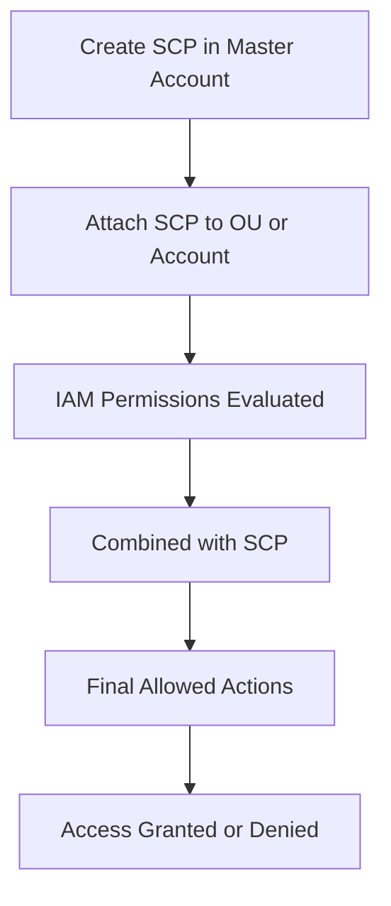

#  AWS Service Control Policies (SCPs) Documentation

---

## Table of Contents

1. [Introduction](#1-introduction)  
2. [What are Service Control Policies?](#2-what-are-service-control-policies)  
3. [Why Use Service Control Policies?](#3-why-use-service-control-policies)  
4. [Workflow Diagram](#4-workflow-diagram)  
5. [Advantages](#5-advantages)  
6. [Best Practices](#6-best-practices)  
7. [Conclusion](#7-conclusion)  
8. [FAQs](#8-faqs)  
9. [Contact Information](#9-contact-information)  
10. [References](#10-references)

---

## 1. Introduction

AWS Service Control Policies (SCPs) are a feature of AWS Organizations that help centrally manage permissions across AWS accounts. They allow you to define the maximum available permissions for accounts in your organization, helping enforce security, compliance, and governance policies.

---

## 2. What are Service Control Policies?

Service Control Policies are **JSON-based permission boundaries** applied at the **organizational unit (OU)** or **account level** within AWS Organizations.

- SCPs do **not grant permissions** but set the **maximum available permissions**.
- They affect **IAM users and roles** in the accounts they apply to.
- If an action is blocked by an SCP, it cannot be performed—even if IAM allows it.

---

## 3. Why Use Service Control Policies?

| Purpose                      | Description                                                                 |
|-----------------------------|-----------------------------------------------------------------------------|
| Centralized Control         | Apply policies at the organizational level for multiple AWS accounts        |
| Restrict Services           | Prevent the use of unwanted or expensive AWS services                        |
| Improve Security Posture    | Enforce compliance and least privilege principle                            |
| Guardrails for Governance   | Ensure only approved services and actions are used                          |
| Prevent Shadow IT           | Avoid usage of unauthorized services                                        |

---

## 4. Workflow Diagram

---

## 5. Advantages

| Advantage                   | Explanation                                                                 |
|----------------------------|-----------------------------------------------------------------------------|
| Organization-wide Control  | Consistent enforcement of permissions across all accounts                   |
| Defense in Depth           | Adds an extra layer beyond IAM and resource-based policies                  |
| Scoped Restrictions        | Apply specific restrictions to subsets of accounts                          |
| Supports Audit & Compliance| Easier to track and enforce security mandates                               |
| No Additional Cost         | Included with AWS Organizations                                             |

---

## 6. Best Practices

| Best Practice                        | Description                                                                 |
|-------------------------------------|-----------------------------------------------------------------------------|
| **Use Deny by Default**             | Start with minimal permissions and expand as needed                        |
| **Attach to OUs, not individual accounts** | Promotes scalability and manageability                                   |
| **Test with Simulations**           | Use IAM Access Analyzer to simulate SCP effects                            |
| **Document All SCPs**               | Maintain versioned records for auditing                                    |
| **Combine with IAM Policies**       | Use SCPs to limit IAM, not replace them                                    |

---

## 7. Conclusion

Service Control Policies offer robust governance over multi-account AWS environments. By placing organization-wide boundaries on what actions are allowed, SCPs enhance **security, consistency, and manageability** of AWS usage across departments or projects. When used correctly, they become a powerful part of your cloud security posture.

---

## 8. FAQs

### 1. **Do SCPs grant permissions?**
No. SCPs only define what permissions are *not* allowed. Permissions must still be granted using IAM.

### 2. **Who can create SCPs?**
Only users in the management/root account with appropriate permissions can create and manage SCPs.

### 3. **Do SCPs apply to the management account?**
Yes, but only if explicitly enabled.

### 4. **What happens if there's a conflict between IAM and SCP?**
The most restrictive policy applies. If SCP denies it, IAM can’t override.

### 5. **Can I use SCPs to allow only read-only access?**
Yes, you can create SCPs that only allow specific actions like `Describe*` or `List*`.

---

## 9. Contact Information

| Contact Type | Details                             |
|--------------|-------------------------------------|
| Maintainer   | DevOps & Security Team              |
| Email        | security-team@example.com           |
| GitHub Repo  | https://github.com/example/aws-scp-docs |

---

## 10. References

| Resource | Link |
|----------|------|
| AWS SCPs Overview | [Link](https://docs.aws.amazon.com/organizations/latest/userguide/orgs_manage_policies_scps.html) |
| AWS Organizations | [Link](https://docs.aws.amazon.com/organizations/latest/userguide/orgs_introduction.html) |
| IAM Access Analyzer | [Link](https://docs.aws.amazon.com/IAM/latest/UserGuide/what-is-access-analyzer.html) |
| Policy Simulator | [Link](https://policysim.aws.amazon.com/) |
