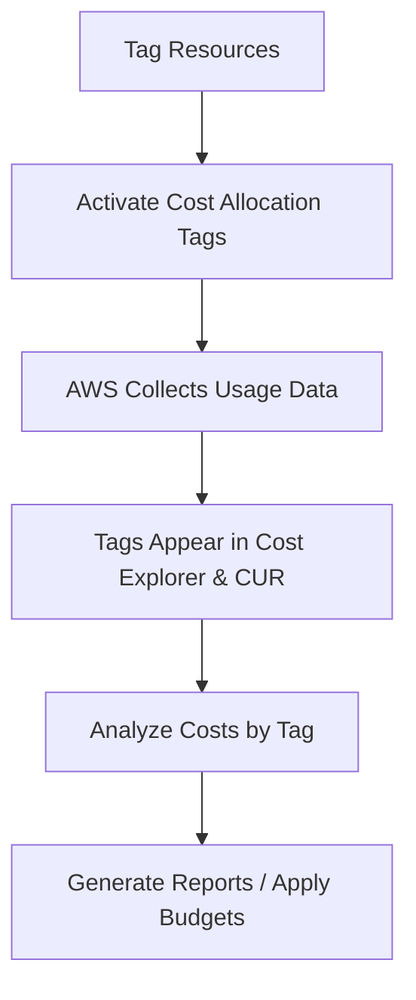

# AWS Cost Allocation Tags Documentation

---

## 📚 Table of Contents

1. [Introduction](#1-introduction)  
2. [What are AWS Cost Allocation Tags?](#2-what-are-aws-cost-allocation-tags)  
3. [Why Use Cost Allocation Tags?](#3-why-use-cost-allocation-tags)  
4. [Workflow Diagram](#4-workflow-diagram)  
5. [Advantages](#5-advantages)  
6. [Best Practices](#6-best-practices)  
7. [Conclusion](#7-conclusion)  
8. [FAQs](#8-faqs)  
9. [Contact Information](#9-contact-information)  
10. [References](#10-references)

## Introduction

AWS Cost Allocation Tags help you track and manage costs in a granular way. By attaching metadata to AWS resources, tags enable accurate cost tracking by project, department, environment, and more. They are essential for cost transparency, chargebacks, and budgeting.

---

## What are AWS Cost Allocation Tags?

Cost Allocation Tags are **key-value pairs** assigned to AWS resources. AWS uses these tags to **organize usage costs** across different dimensions (e.g., teams, workloads).

There are **two types**:
- **AWS-generated tags**: Automatically created by AWS (e.g., `aws:createdBy`).
- **User-defined tags**: Created and managed by users (e.g., `Project: ML-App`).

---

## Why Use Cost Allocation Tags?

| Purpose                      | Description                                                                 |
|-----------------------------|-----------------------------------------------------------------------------|
| Cost Tracking               | Monitor resource spend across projects, teams, or environments              |
| Budget Management           | Allocate costs to specific business units                                  |
| Chargebacks/Showbacks       | Enable internal cost distribution                                          |
| Governance & Compliance     | Ensure resources are tagged properly for audit/reporting                   |
| Forecasting                 | Predict costs based on historical usage by tag                             |

---

## Workflow Diagram

---

## Advantages

| Advantage                   | Explanation                                                                 |
|----------------------------|-----------------------------------------------------------------------------|
| Fine-grained Cost Visibility | Helps breakdown costs by project, team, owner                             |
| Scalability                | Works across all AWS accounts in Organizations                             |
| Automation Support         | Easily integrated with tools like AWS Budgets, Cost Explorer, and Lambda   |
| Governance Aid             | Helps enforce resource tagging through SCPs or tag policies                |
| No Additional Cost         | Tagging and cost allocation is free to use                                 |

---

##  Best Practices

| Best Practice                        | Description                                                                 |
|-------------------------------------|-----------------------------------------------------------------------------|
| **Tag Early and Consistently**      | Apply tags at launch time using IaC, Lambda, or policies                   |
| **Standardize Tag Keys**            | Use consistent formats (e.g., `Environment`, `Owner`, `CostCenter`)        |
| **Use Automation**                  | Enforce tags with AWS Config, Service Control Policies, or Lambda functions |
| **Regular Audits**                  | Periodically verify tag coverage with AWS Tag Editor and reports           |
| **Limit Number of Tags**            | Keep tag keys manageable to avoid confusion                                |
| **Enable Tags for Cost Allocation** | Manually activate each tag for cost tracking in the Billing Console        |

---

## Conclusion

Cost Allocation Tags are **vital tools** for managing and optimizing your AWS costs. When implemented correctly, they enable **full visibility, accountability, and control** over cloud spending. Integrating them into your infrastructure strategy ensures a cost-effective and transparent AWS environment.

---

---

## Frequently Asked Questions (FAQs)

### 1. **Do I need to pay to use Cost Allocation Tags?**
No, AWS does not charge for tagging or viewing cost allocation tags.

### 2. **Are tags automatically applied to all resources?**
No, you must apply tags manually or automate them using tools like AWS Lambda, IaC, or SCPs.

### 3. **How long does it take for tags to show in Cost Explorer?**
Tags typically appear in Cost Explorer within 24 hours after being activated.

### 4. **Can I modify tags after a resource is created?**
Yes, tags can be edited anytime through the AWS Console, CLI, or SDKs.

### 5. **What is the maximum number of tags per resource?**
AWS allows up to 50 tags per resource, including both user-defined and AWS-generated tags.

## Contact Information

| Contact Type | Details                             |
|--------------|-------------------------------------|
| Maintainer   | DevOps & Cloud Team                 |
| Email        | devops-team@example.com             |
| GitHub Repo  | https://github.com/example/aws-cost-tags-doc |

---

---

## References

| Resource | Link |
|----------|------|
| AWS Official Documentation – Cost Allocation Tags | [Link](https://docs.aws.amazon.com/awsaccountbilling/latest/aboutv2/cost-alloc-tags.html) |
| AWS Tagging Best Practices | [Link](https://docs.aws.amazon.com/general/latest/gr/aws_tagging.html) |
| AWS Billing and Cost Management User Guide | [Link](https://docs.aws.amazon.com/awsaccountbilling/latest/aboutv2/billing-what-is.html) |
| AWS Cost Explorer | [Link](https://docs.aws.amazon.com/cost-management/latest/userguide/what-is-cost-explorer.html) |
