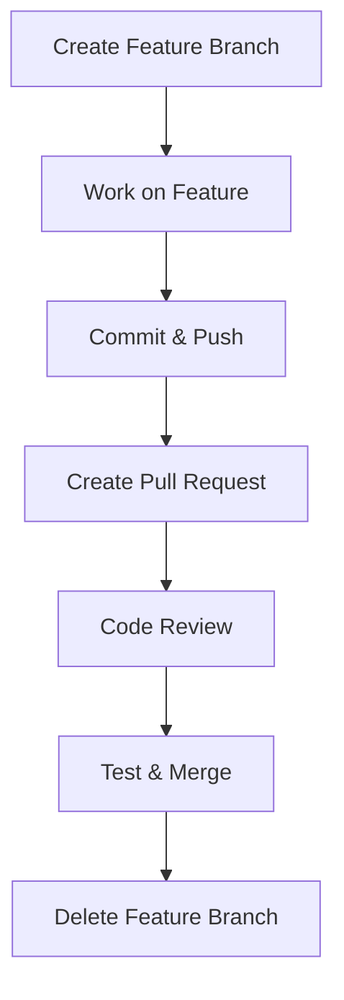

# Feature Branch Workflow Documentation

---

## Table of Contents

1. [Introduction](#1-introduction)  
2. [Why Feature Branch Workflow?](#2-why-feature-branch-workflow)  
3. [Workflow Diagram](#3-workflow-diagram)  
4. [Advantages](#4-advantages)  
5. [Disadvantages](#5-disadvantages)  
6. [Conclusion](#6-conclusion)  
7. [Contact Information](#7-contact-information)  
8. [References](#8-references)

---

## 1. Introduction

The **Feature Branch Workflow** is a Git-based development strategy where each new feature is developed in its own branch, isolated from the `main` or `production` codebase. It allows developers to work independently without interfering with the stable codebase.

---

## 2. Why Feature Branch Workflow?

Feature branching provides a clean way to manage different streams of development while maintaining a stable main branch. It encourages collaboration and code reviews through pull requests and ensures features are tested before they’re merged.

###  Comparison Table

| Criteria               | Feature Branch Workflow       | Trunk-Based Development      |
|------------------------|-------------------------------|------------------------------|
| Isolation              | High                          | Low                          |
| Collaboration          | Moderate to High              | High                         |
| Risk of Conflicts      | Low (if regularly rebased)    | Higher                       |
| Code Review Friendly   | Yes                         |  Limited                   |

---

## 3. Workflow Diagram

---

## 4. Advantages

| Benefit                  | Description                                                   |
| ------------------------ | ------------------------------------------------------------- |
| **Isolation of Work**    | Prevents incomplete or buggy code from affecting main branch. |
| **Code Review Friendly** | Allows easy peer review through Pull Requests.                |
| **Task Focused**         | Developers can focus on one feature at a time.                |
| **CI/CD Friendly**       | Integrates well with automated testing pipelines.             |

---

## 5. Disadvantages

| Limitation                | Impact                                                                      |
| ------------------------- | --------------------------------------------------------------------------- |
| **Merge Conflicts**       | May arise if branches diverge too much.                                     |
| **Long-Lived Branches**   | Can lead to integration hell.                                               |
| **Dependency Management** | Features dependent on others may require rebasing or temporary workarounds. |

---
## 6. Conclusion

**Feature Branch Workflow** is ideal for teams that require structured collaboration, isolated development, and robust code review pipelines. It provides a scalable model for both small and large teams.

However, to prevent issues like merge conflicts and branch divergence, it’s important to **merge frequently** and **keep branches short-lived**.

---
## 7. Contact Information

| Name| Email Address      | GitHub | URL |
|-----|--------------------------|-------------|---------|
| Shree | shreekadam2222htb@gmail.com|  ShreeKadam  |  https://github.com/ShreeKadam   |

---
## 8. References

| Resource Name   | Link                                                                                                           |
| --------------- | -------------------------------------------------------------------------------------------------------------- |
| Git SCM Docs    | [https://git-scm.com/doc](https://git-scm.com/doc)                                                             |
| Atlassian Guide | [Feature Branch Workflow](https://www.atlassian.com/git/tutorials/comparing-workflows/feature-branch-workflow) |
| GitHub Flow     | [https://docs.github.com](https://docs.github.com/en/get-started/quickstart/github-flow)                       |

---

